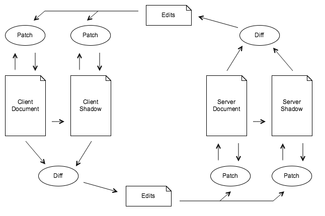

# diffsync [![Dependencies badge][david-image]][david-url] [![DevDependencies badge][david-dev-image]][david-dev-url]


Diffsync is a implementation of [Differential Synchronization][fraser] in
Javascript.


##### Dictionary

* *Document* is the JSON descripting the document (audio, video, etc.).
* *Shadow* is a copy of the document, updated from patches. Document is the
  working file.
* *Edits*? I don't know, yet.


#### När en användaren gör en ändring i sitt dokument:



1. En diff är skapad, med hjälp av [jsondiffpatch][jsondiffpatch], mellan
   klientens text och klientens shadow.
2. Från diffen skapas en lista med ändringar som har gjorts på klientens text.
3. Ändringarna kopieras till klientens shadow.
4. *(a)* En patch skapas från diffen, och skickas till servern. Med [Socket.io][socket].
   *(b)* Om diffen inte innehåller några ändringar skickas inget till servern.
5. På servern patchas serverns text och serverns shadow som tillhör användaren.
6. Nu upprepas processen i andra riktningen för varje klient.


[//]: # (References)
[fraser]: https://neil.fraser.name/writing/sync/ "Differential Synchronization"
[jsondiffpatch]: https://github.com/benjamine/jsondiffpatch "Diff & patch for JavaScript objects"
[socket]: http://socket.io/ "Websocket"


## Installation

TODO


## Usage

TODO


## API DiffSync.client(socket)

##### Params:

* **Socket.io** *socket* Websocket using Socket.io
* **Document** *doc* Optional param for creating the document

```javascript
let { client } = require('diffsync');
let diffsync = client(socket);
```

### update(json)

Update the whole document

##### Params:

* **Object** *json* Information about and instructions for the document

### merge(json)

Merge instructions

##### Params:

* **Object** *json* Instructions for the document

### on(event, listener)

Listen for events

##### Events:

* diff
* patch

##### Params:

* **String** *event* 
* **Function** *listener* 


## API DiffSync.server(socket)

##### Params:

* **Socket.io** *socket* Websocket using Socket.io
* **Document** *doc* Optional param for creating the document

```javascript
let { server } = require('diffsync');
let diffsync = server(socket);
```

### on(event, listener)

Listen for events

##### Events:

* diff
* patch

##### Params:

* **String** *event*
* **Function** *listener*


## License

MIT


[david-url]: https://david-dm.org/klambycom/diffsync#info=dependencies&view=table
[david-image]: https://david-dm.org/klambycom/diffsync.svg?style=flat-square

[david-dev-url]: https://david-dm.org/klambycom/diffsync#info=devDependencies&view=table
[david-dev-image]: https://david-dm.org/klambycom/diffsync/dev-status.svg?style=flat-square
